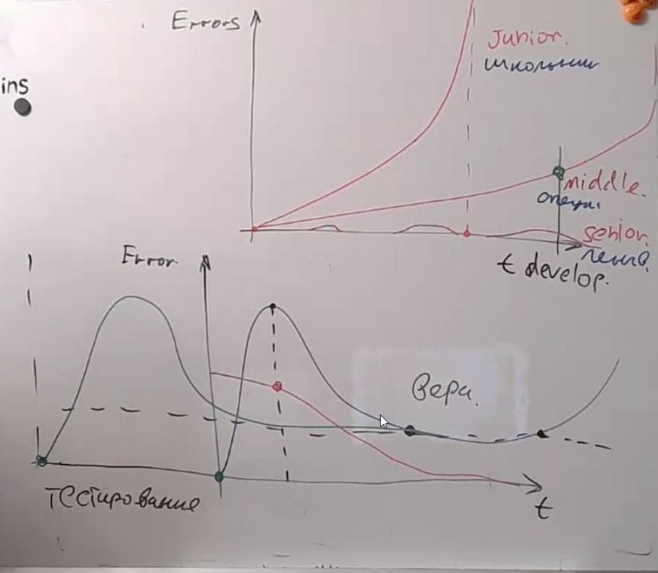
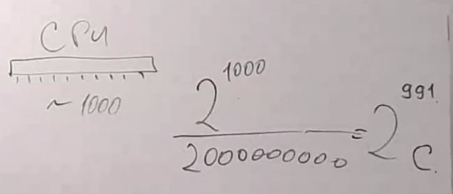
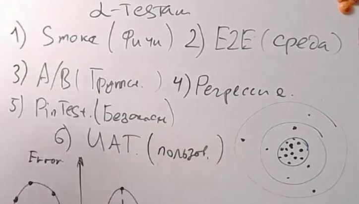

# Урок 12. Принципы тестирования приложений
## Classwork
### Графики разработки продукты(время-ошибки)

### Полностью процессор протестировать не возможно!

### Виды тестирования

## Homework
Разработать тесты под проект системы управления роботом пылесосом(достаточно один протокол):
1) Предложить и разработать E2E тесты https://www.postman.com/ или аналоги.
2) Предложить и разработать приёмочные тесты (UAT) для сценариев Use case https://www.gurock.com/testrail/ или аналоги.

Тесты сдаются в виде протокола(pdf, doc, docx, xls)или ссылка на документ на платформах ( https://www.postman.com/ или 
https://www.gurock.com/testrail/)

[Тестирование приложения робота-пылесоса_Костиков Р.С](src/homework/Тестирование приложения робота-пылесоса_Костиков Р.С.pdf)

(Со звездочкой) Разработать Unit Test для разработанного для проекта кода.